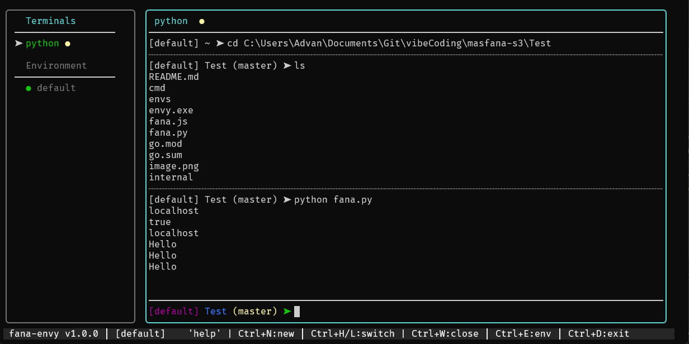

# Fana-Envy

Fana-Envy is a powerful, persistent terminal environment manager built with Go. It allows you to manage environment variables with TUI.



## Features

- **Environment Profiles**: Switch between sets of environment variables instantly.
- **Multiple Terminals**: Manage multiple terminal instances in tabs/panes.
- **Persistent History**: Command history is saved relative to the application binary, ensuring consistency across invocations.
- **Profile Editor**: Built-in editor to modify environment variables on the fly.
- **Cross-Platform**: Designed for Windows (with extensive terminal support) but structured for portability.

## Installation

```bash
git clone https://github.com/MasFana/fana-envy.git
cd fana-envy
go build ./cmd/fana-envy
```

## Usage

Run the executable:

```bash
./fana-envy
```

### Shortcuts

- `Ctrl+N`: New Terminal
- `Ctrl+H` / `Ctrl+L`: Switch Terminal Left/Right
- `Ctrl+E`: Toggle Profile Editor
- `Ctrl+D`: Exit

### Commands

- `new <name>`: Create a new profile
- `switch <name>`: Switch to a profile
- `set <KEY> <VALUE>`: Set an environment variable
- `unset <KEY>`: Remove a variable
- `cd <path>`: Change directory

## Folder Structure

The project follows the standard Go project layout:

```
fana-envy/
├── cmd/
│   └── fana-envy/
│       └── main.go       # Entry point
├── internal/
│   ├── config/           # Configuration loading/saving
│   ├── styles/           # UI styling (Lipgloss)
│   ├── terminal/         # Terminal pane logic
│   ├── tui/              # Main Bubble Tea model & view
│   └── utils/            # Helper functions
└── README.md
```

## Configuration

Configuration files (`.env` profiles) and history (`.fana_history`) are stored in the directory where the binary is located. This allows you to carry the tool on a USB drive or move it between folders without losing your settings.
